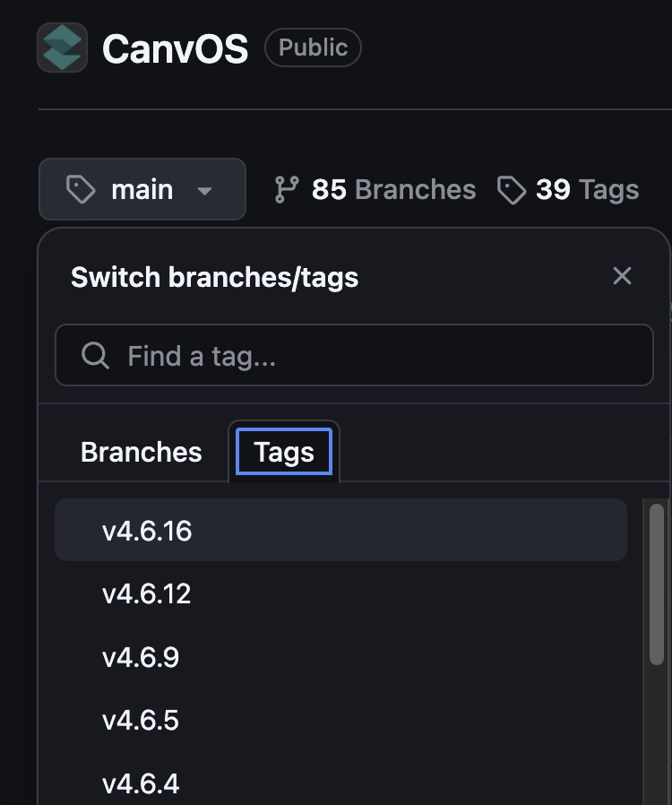
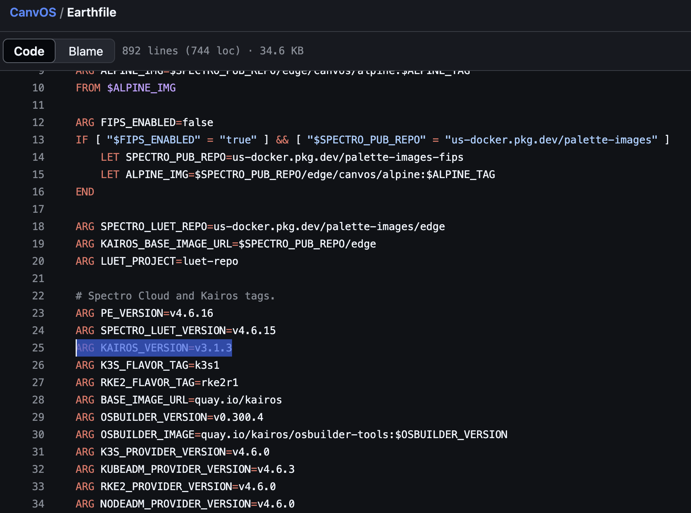
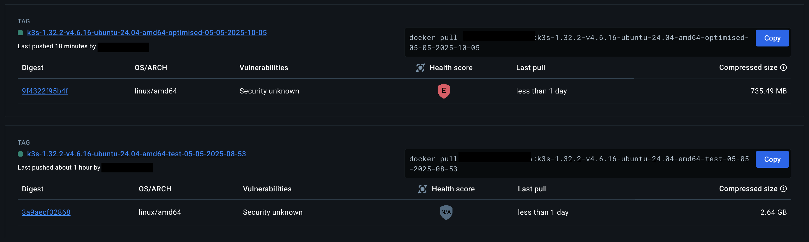

# Minimal Changes for Optimised GRUB-based Kairos Image

This guide shows the minimal changes needed to optimise the Kairos image while keeping GRUB as the bootloader, achieving similar size reductions as the UKI image. In short, we will optimise the `kernel-ubuntu-24.04` stage in Dockerfile.ubuntu using the same size optimization techniques as the `systemd-boot` stage. 

## Prerequisites

### 1. Clone Required Repositories
```bash
git clone https://github.com/kairos-io/kairos
git clone https://github.com/spectrocloud/CanvOS
```

### 2. Select Correct Versions
1. In the CanvOS repository:
   - Go to GitHub and select "Tags" instead of branches
   
   - Select the tag matching the CanvOS version you'd like to build
   - Open the Earthfile in the root directory to check the Kairos version being used (e.g., "v3.1.3")
   

2. In the Kairos repository:
   - Checkout the version that matches your CanvOS version
   - In the `images` folder, look for `Dockerfile.ubuntu`. There should be many Dockerfile', including the one we're looking for
   - If the required files are not available in that version, you may need to checkout the next release  

   ```bash
   git pull origin v3.2.0
   git checkout v3.2.0
   ```
   - We will be using the `Dockerfile.ubuntu` template in this guide
   - Only use the `Dockerfile.{OS}` template files
   - Avoid files like `Dockerfile.kairos-ubuntu`. 
   - `Dockerfile.kairos-*` files are generated during the build process 

## Build Process

When building with the following command:
```bash
./earthly.sh +base-image \
    --FLAVOR=ubuntu \
    --FLAVOR_RELEASE=24.04 \
    --FAMILY=ubuntu \
    --MODEL=generic \
    --VARIANT=core \
    --BASE_IMAGE=ubuntu:24.04 \
    --BOOTLOADER=grub
```

The build process in Dockerfile.ubuntu follows this stage order:
```
FROM ubuntu:24.04 AS ubuntu-24.04-upstream
FROM ubuntu-24.04-upstream AS common
FROM common AS grub
FROM grub AS grub-amd64
FROM grub-amd64 AS grub-current
FROM grub-current AS grub-amd64-24.04
FROM grub-amd64-24.04 AS amd64
FROM amd64-ubuntu-24.04 AS generic
FROM amd64-ubuntu-24.04-generic AS ubuntu-latest
FROM ubuntu-latest AS ubuntu-24.04
FROM ubuntu-24.04 AS all
```

## Stage Hierarchy and Dependencies

The kernel-related stages follow this hierarchy:
```
kernel-ubuntu-24.04
  ↓
amd64-ubuntu-24.04
  ↓
generic
  ↓
amd64-ubuntu-24.04-generic
  ↓
ubuntu-latest
  ↓
ubuntu-24.04
  ↓
all
```

### Stage Purposes

| Stage Name | Purpose/When to Edit |
|------------------------------|-------------------------------------|
| kernel-ubuntu-24.04 | HWE kernel install, kernel changes |
| amd64-ubuntu-24.04 | Inherits kernel stage |
| generic | Model-specific packages |
| amd64-ubuntu-24.04-generic | Inherits generic stage |
| ubuntu-latest | Flavor-specific packages |
| ubuntu-24.04 | Release-specific packages |
| all | Final tweaks |

> **Important**: For HWE kernel changes, edit the `kernel-ubuntu-24.04` stage. For post-kernel changes, use the later stages as appropriate.

## Original Stage

Here's the original `kernel-ubuntu-24.04` stage from the Dockerfile:

```dockerfile
FROM base-ubuntu-current AS kernel-ubuntu-24.04
RUN apt-get update
# If a kernel is already installed, don't try to install it again, this way the base image can
# be non-hwe for older releases
RUN [ -z "$(ls -A /boot/vmlinuz*)" ] && apt-get install -y --no-install-recommends \
    linux-image-generic-hwe-24.04 || true
RUN apt-get clean && rm -rf /var/lib/apt/lists/*
```

### Size Implications of Original Code

1. **HWE (Hardware Enablement) Stack**
   - The original code uses `linux-image-generic-hwe-24.04`
   - HWE includes additional drivers and firmware
   - Can add 100-200MB to the image size
   - Includes support for newer hardware that might not be needed

2. **Package Management**
   - Multiple `apt-get update` calls create larger layers
   - No cleanup between package installations
   - Potential for unnecessary package recommendations
   - No removal of unnecessary packages

3. **Kernel Management**
   - No conditional module installation
   - No optimization of kernel components
   - Potential for duplicate kernel installations
   - No version control for modules

## Optimised Implementation

The following optimization is adapted from the `common AS systemd-boot` stage, which already implements these efficient techniques. Replace the original `kernel-ubuntu-24.04` stage with this optimised version:

```dockerfile
FROM base-ubuntu-current AS kernel-ubuntu-24.04
SHELL ["/bin/bash", "-o", "pipefail", "-c"]

# Install essential packages
RUN apt-get update && apt-get install -y --no-install-recommends \
  iucode-tool \
  kmod \
  linux-base \
  && apt-get remove -y unattended-upgrades && apt-get clean && rm -rf /var/lib/apt/lists/*

# Install latest kernel modules if none exist
RUN [ -z "$(ls -A /lib/modules/)" ] && apt-get update && apt-get install -y --no-install-recommends \
  "$(apt-cache search linux-modules | grep -oP 'linux-modules-\d+.\d+.\d+-\d+-generic' | sort -V | tail -1)" \
  && apt-get remove -y unattended-upgrades && apt-get clean && rm -rf /var/lib/apt/lists/*

# Install latest kernel image if none exists
RUN [ -z "$(ls -A /boot/vmlinuz*)" ] && apt-get update && apt-get install -y --no-install-recommends \
  "$(apt-cache search linux-image | grep -oP 'linux-image-\d+.\d+.\d+-\d+-generic' | sort -V | tail -1)" \
  && apt-get remove -y unattended-upgrades && apt-get clean && rm -rf /var/lib/apt/lists/*
```

## Run CanvOS Edge build
1. Make sure you've pushed the new optimised kairos image to a registry
2. Now just follow the standard CanvOS build process and add your new base image to your `.arg` file with the `BASE_IMAGE` variable. Here's an example: 

```
K8S_VERSION=
CUSTOM_TAG=
IMAGE_REGISTRY=
OS_DISTRIBUTION=ubuntu
IMAGE_REPO=repo
OS_VERSION=24.04
K8S_DISTRIBUTION=k3s
ISO_NAME=installer-ubuntu-24.04-optimised
ARCH=amd64
HTTPS_PROXY=
HTTP_PROXY=
PROXY_CERT_PATH=
UPDATE_KERNEL=false
CLUSTERCONFIG=spc.tgz
CIS_HARDENING=false
EDGE_CUSTOM_CONFIG=.edge-custom-config.yaml
BASE_IMAGE=registry/repo:new-optimised-kairos-base-image
```

## Example Result 
Here's an example output of a standard CanvOS Edge build and one following the optimised GRUB guide. The optimised image is just `735.49 MB` compared to the standard `2.64 GB` image.  




## Key Changes and Benefits

1. **Added Essential Packages First**
   - Installs `iucode-tool`, `kmod`, and `linux-base` before kernel packages
   - Ensures proper kernel and module management
   - Matches the optimization approach used in `systemd-boot`

2. **Conditional Kernel and Module Installation**
   - Only installs if components are missing
   - Automatically selects latest versions
   - Reduces image size by avoiding duplicate installations

3. **Improved Package Management**
   - Uses `--no-install-recommends` consistently
   - Cleans up after each installation step
   - Removes unnecessary packages immediately

4. **Better Error Handling**
   - Added `pipefail` for better error detection
   - More robust package installation process
   - Better debugging capabilities

## Size Optimization Benefits

1. **Minimal Package Installation**
   - Only installs essential packages
   - Uses `--no-install-recommends` to avoid unnecessary dependencies
   - Removes unattended-upgrades to reduce size

2. **Conditional Installation**
   - Avoids duplicate installations
   - Prevents unnecessary package downloads
   - Reduces final image size

3. **Cleanup After Each Step**
   - Removes package lists
   - Cleans apt cache
   - Reduces layer size

## Best Practices for Further Optimization

1. **Package Management**
   - Always use `--no-install-recommends`
   - Remove unnecessary packages immediately after installation
   - Clean apt cache in the same layer as installation

2. **Layer Optimization**
   - Combine related RUN commands
   - Clean up in the same layer as installation
   - Use conditional installation to avoid unnecessary layers

3. **Image Size Reduction**
   - Remove unnecessary files after package installation
   - Consider using multi-stage builds
   - Compress large files when possible

## When to Use This Optimization

This optimization is ideal when:
- Building Ubuntu 24.04-based images
- Image size is a critical concern
- Need to maintain kernel functionality
- Want to reduce overall image size

## When Not to Use

Avoid this optimization when:
- Need specific kernel versions
- Require additional kernel features
- Need additional security features
- Have specific package version requirements


## Important Notes About Bootloader Choices and Image Types

### Bootloader Types and Image Sizes
- **systemd-boot (UKI)**: Results in a smaller image size
- **GRUB (non-UKI)**: Results in a larger image size

### Base Image Considerations
The base Ubuntu image (64MB) is minimal and requires additional components to be bootable. This guide focuses on optimizing the GRUB-based approach, but it's important to understand the implications of your bootloader choice.

### Critical UKI Configuration Warning
> **⚠️ Important**: If you create a UKI image with Kairos using systemd-boot as the bootloader, you **must** configure CanvOS to recognize it as a secure edge UKI-based image, by setting the UKI variables in the .arg file. Failure to do so will result in deployment failures because:
> - CanvOS will look for GRUB bootloader components
> - Required components like dracut will not be found
> - The deployment will fail due to missing expected bootloader components

### Hardware Compatibility Considerations
Since this optimization avoids installing the HWE (Hardware Enablement) package:
1. Some hardware components (like network adapters) might not work out of the box
2. Testing procedure:
   - First test with the normal (non-optimised) image
   - If hardware works with normal image but not with optimised image:
     - Add missing Linux modules either:
       - In the CanvOS Dockerfile
       - In the Dockerfile when building the Kairos image

### Example Commands for Different Image Types

#### Ubuntu 24.04 Image - UKI Output
```bash
./earthly.sh +base-image \
    --FLAVOR=ubuntu \
    --FLAVOR_RELEASE=24.04 \
    --FAMILY=ubuntu \
    --MODEL=generic \
    --VARIANT=core \
    --BASE_IMAGE=ubuntu:24.04 \
    --BOOTLOADER=systemd-boot
```

#### Ubuntu 24.04 Image - GRUB Output
```bash
./earthly.sh +base-image \
    --FLAVOR=ubuntu \
    --FLAVOR_RELEASE=24.04 \
    --FAMILY=ubuntu \
    --MODEL=generic \
    --VARIANT=core \
    --BASE_IMAGE=ubuntu:24.04 \
    --BOOTLOADER=grub
```

#### Custom Base Image - UKI Output
```bash
./earthly.sh +base-image \
    --FLAVOR=ubuntu \
    --FLAVOR_RELEASE=24.04 \
    --FAMILY=ubuntu \
    --MODEL=generic \
    --VARIANT=core \
    --BASE_IMAGE=test.company.com/library/ubuntu-custom:24.04 \
    --BOOTLOADER=systemd-boot
```

> **Note**: When using custom base images, ensure your CanvOS .arg file configuration matches the bootloader type you've chosen. Mismatched configurations will lead to deployment failures. 